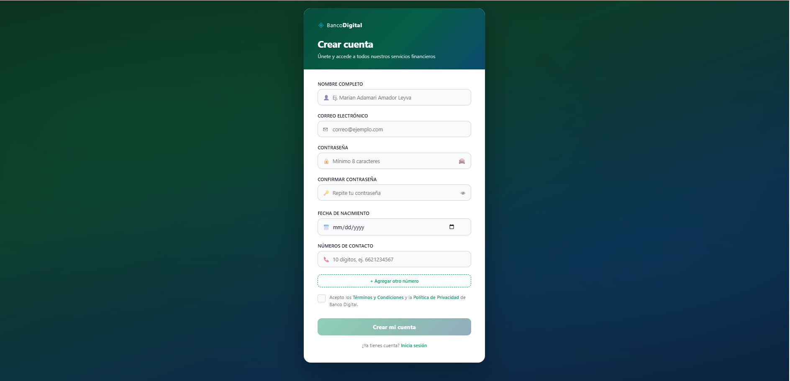
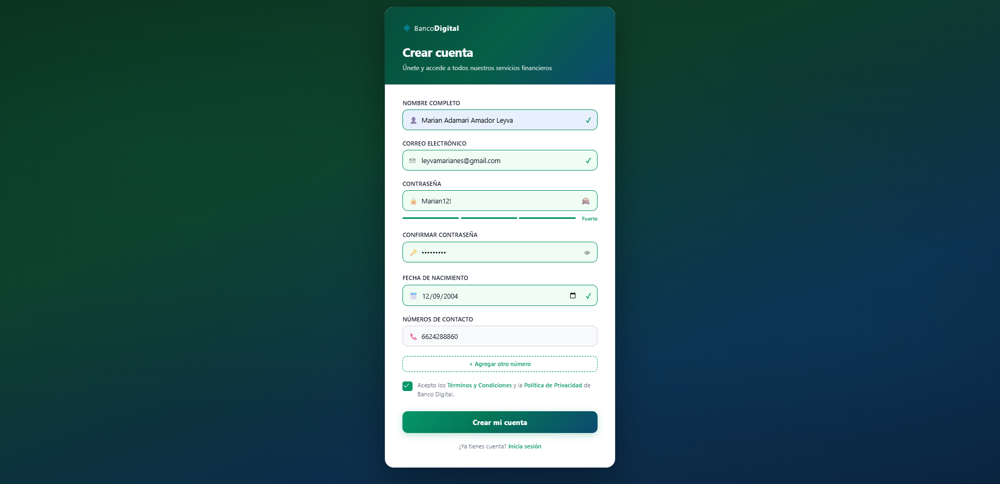
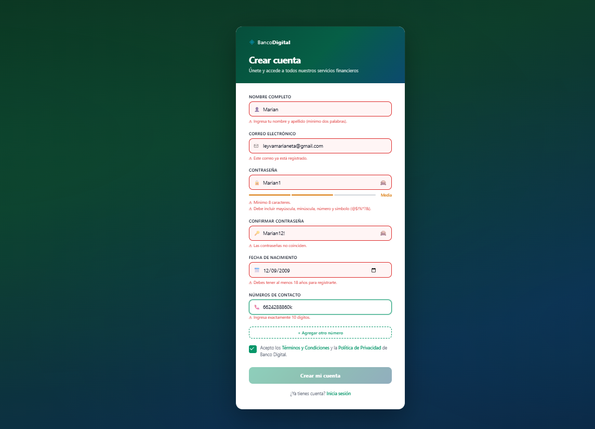
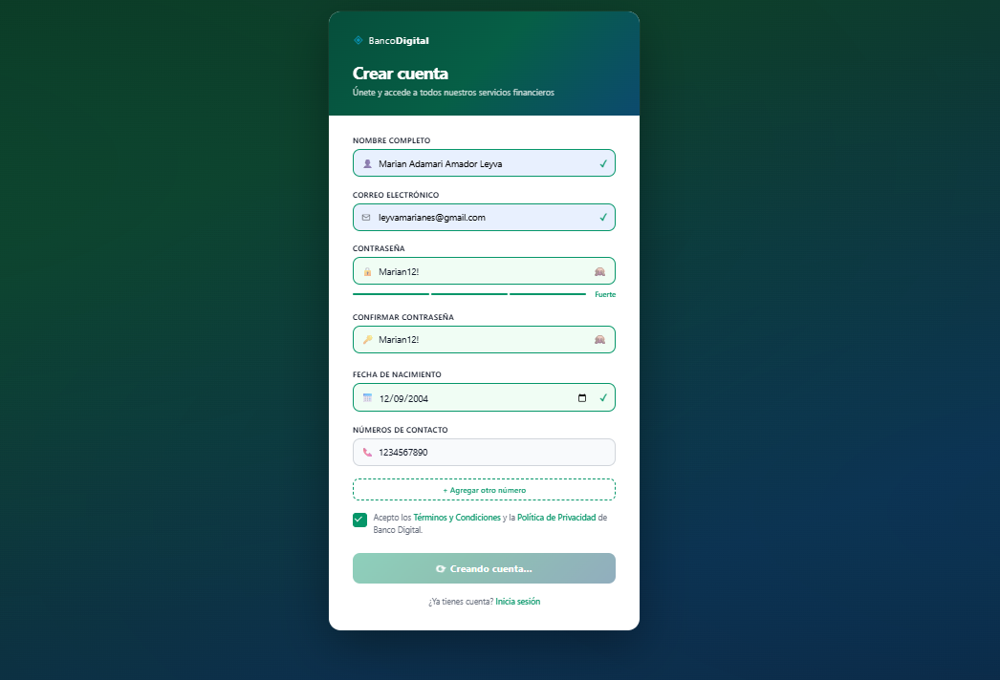

Página: https://marianamador.github.io/BancoDigital/
 Correos para validar: test@banco.com, leyvamarianeta@gmail.com

# Banco Digital — Formulario de Registro

Práctica de Formularios Avanzados con Angular. Formulario de registro para un banco digital con validaciones en tiempo real, validadores personalizados y validaciones asíncronas.

---

## Capturas de pantalla

### Formulario completo


### Validaciones en tiempo real


### Errores en campos


### Simulación de envío


---

## Tecnologías

- Angular 17+
- TypeScript
- ReactiveFormsModule
- CSS

---

## Estructura del proyecto

```
src/
└── app/
    ├── registro/
    │   ├── registro.component.ts
    │   ├── registro.component.html
    │   ├── registro.component.css
    │   └── validators.ts
    ├── app.ts
    ├── app.config.ts
    └── app.routes.ts
```

---

## Campos del formulario

| Campo | Validaciones |
|---|---|
| Nombre completo | Requerido, mínimo dos palabras, solo letras |
| Correo electrónico | Requerido, formato válido, no registrado (async) |
| Contraseña | Requerido, mín. 8 caracteres, mayúscula + minúscula + número + símbolo |
| Confirmar contraseña | Requerido, debe coincidir con la contraseña |
| Fecha de nacimiento | Requerido, mayor de 18 años |
| Teléfonos | Requerido, exactamente 10 dígitos (FormArray) |
| Términos y condiciones | Debe estar aceptado |

---

## Cómo correrlo

```bash
npm install
ng serve
```

Abrir en: `http://localhost:4200`

---

## Funcionalidades

- Validación en tiempo real por campo
- Medidor de fortaleza de contraseña
- Mostrar / ocultar contraseña
- Verificación asíncrona de correo (simulada)
- Agregar y eliminar teléfonos dinámicamente
- Reset del formulario tras envío exitoso
- Envío simulado a API con `setTimeout`

